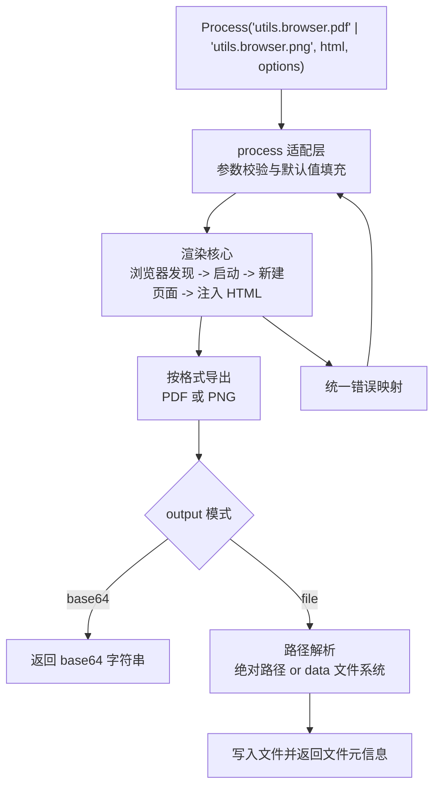

# feat: Add browser HTML rendering processes

## Overview

为 Yao 增加框架内建的浏览器渲染能力，向 JS 侧公开 `utils.browser.pdf` 与 `utils.browser.png` 两个进程。首版只处理 HTML 字符串输入，支持 `base64` 返回和文件输出两种消费方式，并保持公共接口与底层 `rod` 实现解耦。

## Problem Frame

当前仓库缺少通用的 HTML 到 PDF/PNG 渲染能力。业务若要生成报表、海报或页面快照，通常需要绕到外部服务或命令行工具，带来部署、排障和一致性成本。此计划的目标是在框架层补齐这块能力，同时遵守已有 `process.RegisterGroup`、`utils.Init()`、`exception.New(...)`、`gou/fs` 等项目惯例，减少引入新能力后的认知偏差。(see origin: `docs/brainstorms/2026-04-14-yao-browser-rendering-requirements.md`)

## Requirements Trace

- R1. 提供 `utils.browser.pdf` 进程
- R2. 提供 `utils.browser.png` 进程
- R3. 公共接口不暴露 `rod.*`
- R4. 首版仅支持 HTML 字符串输入
- R5. 支持 `base64` 返回
- R6. 支持文件输出
- R7. 文件输出同时支持绝对路径与 `data` 路径
- R8. 提供最小但够用的渲染选项
- R9. 底层实现使用 `github.com/go-rod/rod`
- R10. 浏览器发现顺序采用“显式配置/系统浏览器优先，`rod` 兜底”
- R11. 错误对外为框架异常
- R12. 首版保持无状态
- R13. CLI 与 JS `Process(...)` 行为一致
- R14. 覆盖基础成功/失败测试
- R15. 提供最小调用示例

## Scope Boundaries

- 不支持 URL 渲染
- 不支持本地 HTML 文件输入
- 不做浏览器池或复用会话
- 不覆盖登录态、点击交互、复杂等待脚本
- 不公开 `rod` 级别 DSL 契约

## Context & Research

### Relevant Code and Patterns

- `utils/process.go` 负责集中注册 `utils.*` 进程组，是本次能力最匹配的挂载点
- `attachment/process.go` 展示了典型的 `ValidateArgNums`、`ArgsMap`、`exception.New(...).Throw()` 参数与错误风格
- `fs/fs.go` 会将 `data` 注册为 `gou/fs` 文件系统，可通过 `fs.Get("data")` + `fs.WriteFile(...)` 写入相对路径
- 当前 `gou/fs` 的 system 实现会自动创建父目录，这对文件输出模式很关键
- `utils/str_test.go`、`utils/throw_test.go` 体现了 `utils` 进程的测试组织方式
- `types/volc.im.d.ts` 说明仓库已接受为 process 能力补充 TypeScript 声明文件

### Institutional Learnings

- 当前仓库未发现 `docs/solutions/` 下的相关沉淀

### External References

- Rod 官方仓库与文档，确认该库面向 Chrome DevTools Protocol 自动化场景，适合作为内部实现
- Rod API 参考中已有页面截图与 PDF 导出能力，可支撑本次首版需求

## Key Technical Decisions

- **将能力收敛到 `utils.browser` 命名空间**：与现有 `utils.template`、`utils.redis` 等分组风格一致，同时避免把第三方库名锁死为公共接口
- **渲染核心与 process 适配分层**：在 `utils/browser` 内封装浏览器发现、页面注入、导出和输出写入，`process` 入口只做参数校验与错误翻译
- **输入模型只保留 HTML 字符串**：避免首版把 URL 导航、网络失败、资源权限和等待时序一并带入
- **输出模式统一抽象为 `base64` / `file`**：保证 PDF 和 PNG 调用形态一致，降低 JS 侧学习成本
- **路径写入采用“绝对路径直写，其他路径视为 `data` 文件系统路径”**：与仓库现有文件系统模型对齐，减少额外配置
- **浏览器发现采用分层策略**：先读显式环境变量，再尝试系统常见浏览器路径，最后才交给 `rod` 兜底，保证可控性优先

## Open Questions

### Resolved During Planning

- `output=file` 的路径解析采用二分规则：绝对路径写系统文件，本次能力内的非绝对路径写入 `data` 文件系统
- 首版为 `utils.browser` 补 TypeScript 声明文件，和已有 `types/volc.im.d.ts` 风格保持一致

### Deferred to Implementation

- 最终环境变量键名要在实现时定稿，但计划约束其语义应清楚区分“浏览器可执行文件路径”与“是否允许下载/兜底”
- 浏览器可用性的测试在不同开发机上可能需要条件化处理，具体采用跳过策略还是假实现需在编码时按测试环境落定

## Output Structure

    utils/
      browser/
        browser.go
        options.go
        process.go
        types.go
        browser_test.go
        process_test.go
        README.md
    types/
      utils.browser.d.ts

## High-Level Technical Design

> *This illustrates the intended approach and is directional guidance for review, not implementation specification. The implementing agent should treat it as context, not code to reproduce.*

## Implementation Units

- [ ] **Unit 1: 建立浏览器渲染核心**

**Goal:** 在 `utils/browser` 中建立首版渲染核心，统一封装浏览器发现、HTML 注入、PDF/PNG 导出与选项规范化。

**Requirements:** R1, R2, R4, R8, R9, R10, R12

**Dependencies:** None

**Files:**
- Create: `utils/browser/browser.go`
- Create: `utils/browser/options.go`
- Create: `utils/browser/types.go`
- Test: `utils/browser/browser_test.go`
- Modify: `go.mod`
- Modify: `go.sum`

**Approach:**
- 定义共享的选项结构，将通用选项与 PDF/PNG 特有选项收口到同一规范化入口
- 将“浏览器可执行文件发现”和“页面导出”分开，避免 process 适配层理解浏览器细节
- 明确 HTML 注入策略，确保 `base_url`、视口、等待时序在两个导出格式上的行为一致
- 保持无状态设计，每次调用独立获取浏览器上下文和页面资源，不引入复用池

**Patterns to follow:**
- `attachment/process.go`
- `utils/process.go`
- `fs/fs.go`

**Test scenarios:**
- Happy path: 给定最小 HTML 字符串，PDF 导出返回非空字节结果
- Happy path: 给定最小 HTML 字符串，PNG 导出返回非空字节结果
- Edge case: 未提供可选参数时，默认视口与超时配置可完成渲染
- Edge case: 提供 `base_url` 时，HTML 中相对资源解析行为符合预期
- Error path: HTML 为空或不是字符串时，返回 400 级参数错误
- Error path: 浏览器无法发现且兜底启动失败时，返回框架可读错误而不是底层堆栈

**Verification:**
- 核心渲染函数可独立产出 PDF/PNG 字节结果，并对参数/浏览器异常给出稳定错误

- [ ] **Unit 2: 接入 process 注册与参数映射**

**Goal:** 将浏览器渲染能力以 `utils.browser.pdf` 与 `utils.browser.png` 挂到现有 `utils` 进程命名空间。

**Requirements:** R1, R2, R3, R8, R11, R13

**Dependencies:** Unit 1

**Files:**
- Create: `utils/browser/process.go`
- Modify: `utils/process.go`
- Test: `utils/browser/process_test.go`

**Approach:**
- 采用 `process.RegisterGroup("utils.browser", ...)` 而不是单独裸注册，保持 `utils` 风格一致
- 让 process 入口负责 `ValidateArgNums`、`ArgsString`、`ArgsMap`、默认值填充和错误翻译
- 确保两个进程的调用形态一致，只在格式特有选项上分岔

**Patterns to follow:**
- `attachment/process.go`
- `openai/process.go`
- `utils/throw_test.go`

**Test scenarios:**
- Happy path: `process.New("utils.browser.pdf", html, options)` 能成功返回 `base64`
- Happy path: `process.New("utils.browser.png", html, options)` 能成功返回 `base64`
- Edge case: 仅传 HTML 参数时，process 层能补齐默认选项并成功调用核心渲染
- Error path: 参数数量不对时，沿用现有 `ValidateArgNums` 错误风格
- Error path: `output` 传非法值时，返回明确业务异常
- Integration: CLI `yao run` 走 process 执行路径时，与测试中的 `process.New(...).Exec()` 返回契约一致

**Verification:**
- `utils.browser.*` 在框架初始化后可被统一发现和调用，且错误信息与现有 `utils.*` 进程风格一致

- [ ] **Unit 3: 完成输出写入与文件元信息返回**

**Goal:** 为 `output=file` 实现双路径写入能力，支持本地绝对路径与 `data` 文件系统路径，并返回一致的文件结果结构。

**Requirements:** R5, R6, R7, R11, R13

**Dependencies:** Unit 1

**Files:**
- Modify: `utils/browser/browser.go`
- Modify: `utils/browser/types.go`
- Test: `utils/browser/browser_test.go`

**Approach:**
- 在渲染核心内新增单一输出写入入口，负责路径分类、写入和结果对象构造
- 绝对路径通过系统文件写入，非绝对路径通过 `fs.Get("data")` 写入，避免调用方显式传文件系统名
- 返回结果对象至少包含文件路径、内容类型、大小，供 JS 上层继续上传或包装

**Patterns to follow:**
- `fs/fs.go`
- `attachment/manager.go`

**Test scenarios:**
- Happy path: `output=base64` 时返回字符串而不是文件对象
- Happy path: `output=file` 且路径为绝对路径时，文件被创建且返回正确元信息
- Happy path: `output=file` 且路径为相对路径时，文件写入 `data` 根目录并返回正确元信息
- Edge case: 嵌套目录路径不存在时，写入逻辑能自动创建父目录
- Error path: `output=file` 但未提供路径时，返回明确参数错误
- Error path: `data` 文件系统不可用或写入失败时，返回框架异常
- Integration: PDF 与 PNG 两种格式都复用同一输出模式，内容类型与扩展名映射一致

**Verification:**
- 同一套输出模式在两种渲染格式下都成立，且文件落盘行为与返回对象一致

- [ ] **Unit 4: 补测试资产、类型声明与最小文档**

**Goal:** 让新能力可被测试、被 JS 开发者发现，并具备最小可用文档。

**Requirements:** R14, R15

**Dependencies:** Unit 2, Unit 3

**Files:**
- Create: `types/utils.browser.d.ts`
- Create: `utils/browser/README.md`
- Test: `utils/browser/process_test.go`

**Approach:**
- 按现有 `types/volc.im.d.ts` 风格为 `utils.browser` 提供最小 TS 声明，覆盖 HTML 输入与 options 结构
- README 只写首版承诺范围、调用示例和运行时前提，不扩展到未实现的 URL/自动化能力
- 将测试说明聚焦为“哪些场景必须稳定”，而不是写执行脚本

**Patterns to follow:**
- `types/volc.im.d.ts`
- `utils/redis/README.md` 中的 process 调用展示方式

**Test scenarios:**
- Happy path: TS 声明覆盖 `pdf` 与 `png` 两个入口的常见参数
- Edge case: README 示例同时覆盖 `base64` 与文件输出两种模式
- Error path: 文档明确声明 URL/本地 HTML 文件输入不在首版范围内，避免误导实现和调用方

**Verification:**
- 新能力具备可追随的示例与声明文件，JS 调用方无需读 Go 源码即可理解首版契约

## System-Wide Impact

- **Interaction graph:** `main.go` -> `utils.Init()` -> `utils/process.go` -> `utils.browser.*` -> `rod`/Chrome -> 可选文件写入
- **Error propagation:** 浏览器发现、页面注入、导出和文件写入错误都需要在 `utils.browser` 层收敛，再通过 process 层转成框架异常
- **State lifecycle risks:** 临时浏览器资源、页面对象和可能的输出文件必须在失败路径上正确清理，避免残留僵尸浏览器或半写入文件
- **API surface parity:** `pdf` 与 `png` 的通用选项、输出模式和错误形态要尽量保持一致，避免上层 JS 为两个入口分别写分支
- **Integration coverage:** 仅靠核心单测不够，需要覆盖 process 入口与文件系统写入的跨层行为
- **Unchanged invariants:** 现有 `utils.*` 进程、`attachment` 流程和文件系统注册机制不应被重构或重命名；本次只在现有惯例上扩展浏览器渲染能力

## Risks & Dependencies

| Risk | Mitigation |
|------|------------|
| 开发机或 CI 缺少 Chrome/Chromium，导致测试或运行不稳定 | 将浏览器发现逻辑显式化，并让测试对“浏览器不可用”有稳定失败断言 |
| `rod` 兜底下载行为在不同环境下不一致 | 将“显式配置/系统浏览器优先”放在前面，减少对下载机制的依赖 |
| 文件输出路径规则不清，导致写入位置意外 | 在实现与文档中固定“绝对路径=系统文件，其他路径=data 文件系统”的规则 |
| PDF 与 PNG 接口渐渐分叉，增加上层复杂度 | 先抽公共选项与输出模式，只把格式特有参数留在分支逻辑里 |

## Documentation / Operational Notes

- 需要在文档中明确运行环境依赖浏览器可执行文件
- 若后续发布二进制到无浏览器环境，需在发布说明中补充部署前提
- 如果首版上线后使用频率高，再评估浏览器池与 URL 渲染是否值得单独立项

## Sources & References

- **Origin document:** `docs/brainstorms/2026-04-14-yao-browser-rendering-requirements.md`
- Related code: `utils/process.go`
- Related code: `attachment/process.go`
- Related code: `fs/fs.go`
- External docs: https://github.com/go-rod/rod
- External docs: https://pkg.go.dev/github.com/go-rod/rod
