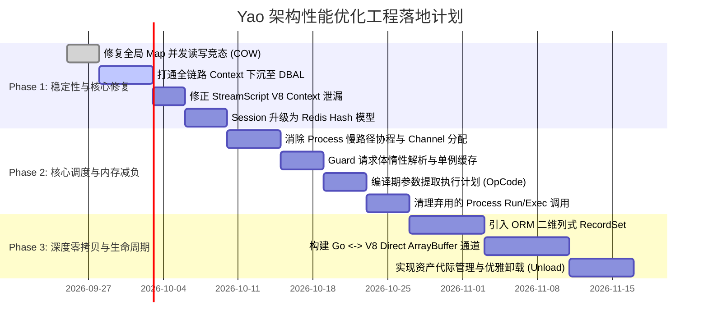

# SPEC-0001: Yao 架构与性能全方位优化工程技术规范
(Yao Engine Architecture & Performance Optimization Specification)

| 元数据项 | 说明 |
| :--- | :--- |
| **RFC 编号** | RFC-20260920-PERF-ARCH |
| **状态** | Draft / Proposal |
| **目标仓库** | `yao`, `gou`, `xun`, `kun`, `v8go` |
| **影响范围** | Process 调度内核、V8 CGO 运行时、HTTP API 网关、Model/Xun 数据访问层、Session 存储、引擎生命周期 |
| **基准版本** | Go 1.25+, Yao 0.10.4+, Gou v0.10.4+ |

---

## 1. 概述与设计目标 (Executive Summary & Goals)

### 1.1 背景
Yao 是一个以 DSL 为核心的微内核应用引擎，融合了 Go 高性能服务运行时、嵌入式 V8 脚本引擎、Xun 关系型数据库抽象层（DBAL）以及声明式 API/Flow/Model 编排。
在面对高并发 API 请求（5,000+ QPS）、大批量数据处理以及复杂脚本业务逻辑时，系统在**调度并发模型、CGO 数据跨界、内存重度分配（Map/UnDot）、网络 RTT 放大及热重载安全**上暴露了若干瓶颈与设计缺陷。

### 1.2 核心目标 (Goals)
1. **调度内核减负**：消除 Process 慢路径上瞬时 Goroutine 与 Channel 的过度分配，根除孤儿协程泄漏，全面下沉 `context.Context` 取消信号。
2. **CGO 跨界性能提升**：消除 Go 与 V8 之间无节制的双向 JSON 序列化中转，大幅降低 V8 Runner 重置时的跨界同步调用。
3. **网关层零浪费**：消除 Guard 中间件对 Request Body 的破坏性二次读取与多余反序列化，参数提取改用预编译执行计划。
4. **数据访问层轻量化**：以紧凑列式二维记录集（`RecordSet`）替代多层嵌套 Map 与递归 `UnDot()`，消灭反射热路径，阻断内存膨胀。
5. **Session 聚合与批量化**：Redis Session 存储全面升级为 Hash 结构，单次请求会话网络交互次数由 $N$ 次收敛为 1 次。
6. **无锁读与安全生命周期**：全局注册表全面切换为基于 `atomic.Pointer` 的 Copy-On-Write (COW) 机制，杜绝并发读写 Crash，实现零停机优雅热重载。

### 1.3 非目标 (Non-Goals)
* 不变更现有 Yao DSL 的外层规范（保持 `.mod.yao`、`.http.yao`、`.flow.yao` 语法兼容）。
* 不替换现有的 V8 引擎内核（继续沿用定制的 `v8go`，重点在其上层桥接与生命周期做架构改造）。

---

## 2. 现状瓶颈与根本原因分析 (Problem Statement)

```
┌─────────────────────────────────────────────────────────────────────────────┐
│                           高并发请求执行路径瓶颈分析                           │
└─────────────────────────────────────────────────────────────────────────────┘
  HTTP Request 
       │
       ▼
 [ProcessGuard] ──────> 瓶颈 1: io.ReadAll(Body) + Unmarshal + NopCloser 重复拷贝
       │
       ▼
 [API parseIn]  ──────> 瓶颈 2: 动态闭包切片遍历分配 + Session 单键离散查询 (N 次 Redis RTT)
       │
       ▼
[Process.Execute] ────> 瓶颈 3: Slow-Path 盲目创建子 Goroutine + make(chan, 1) + 孤儿协程泄漏
       │
       ├─────────────────────────────────┬──────────────────────────────────┐
       ▼                                 ▼                                  ▼
[Model / Xun ORM]                 [Runtime V8 Script]              [Flow DAG Engine]
 瓶颈 4:                           瓶颈 5:                          瓶颈 6:
 • Context 链条断裂                • Go -> JS: jsoniter.Marshal     • 每节点全量复制上下文
 • mapScan 分配海量 Map              -> JSONParseBytes                • 每节点全量递归 .Dot()
 • fmtRow 深度 Undot 拷贝          • JS -> Go: MarshalJSON 
 • SQL 构建大量运行时反射            -> jsoniter.Unmarshal
                                   • 每请求 reset 同步取堆统计
                                   • StreamScript 销毁 Context
```

---

## 3. 详细架构规格说明 (Detailed Technical Specifications)

---

### 3.1 调度内核：无分配上下文感知 Process 调度引擎

#### 3.1.1 现状缺陷
在 `gou/process/process.go` 中，当传入 `process.Context` 时，采用 `go func() { ... }()` + `resChan := make(chan execResult, 1)` + `select` 模式。在高并发下每秒凭空制造数万个瞬时协程和通道；且主协程因超时退出时，子协程无法被中断，沦为孤儿协程。

#### 3.1.2 架构改造方案
1. **内联同步执行模型**：
   彻底移除 `Execute()` 内的子协程派生逻辑，所有 Process 默认在当前 Goroutine 同步运行。
2. **协同式取消（Cooperative Cancellation）**：
   * 在进入 Handler 前检查 `p.Context.Err()`；
   * 在耗时 Handler（如循环、批处理）中按需检查 `p.Context.Done()`；
   * 对于底层 IO（SQL 查询、HTTP 调用），直接将 `p.Context` 传递至底层驱动。
3. **结构体对象池复用**：
   使用 `sync.Pool` 复用 `Process` 实例，消除核心调度路径上的堆逃逸。

#### 3.1.3 核心数据结构与接口契约
```go
// gou/process/process.go

var processPool = sync.Pool{
    New: func() any {
        return &Process{
            Global: make(map[string]interface{}, 8),
            Args:   make([]interface{}, 0, 8),
        }
    },
}

// AcquireProcess 从对象池获取并初始化 Process
func AcquireProcess(ctx context.Context, name string, args ...interface{}) (*Process, error) {
    p := processPool.Get().(*Process)
    p.Reset()
    p.Name = name
    p.Args = append(p.Args, args...)
    p.Context = ctx
    if err := p.make(); err != nil {
        p.Release()
        return nil, err
    }
    return p, nil
}

// Execute 统一同步执行模型（零额外协程，零通道分配）
func (p *Process) Execute() (err error) {
    if p.Context != nil {
        if err := p.Context.Err(); err != nil {
            return err
        }
    }

    hd, err := p.handler()
    if err != nil {
        return err
    }

    defer func() {
        if recovered := recover(); recovered != nil {
            err = exception.Catch(recovered)
            if err != nil {
                exception.DebugPrint(err, "%s", p)
            }
        }
    }()

    val := hd(p)
    p._val = &val
    return nil
}

// Release 将 Process 归还对象池
func (p *Process) Release() {
    if p == nil {
        return
    }
    p.Reset()
    processPool.Put(p)
}

func (p *Process) Reset() {
    p.Name = ""
    p.Context = nil
    p.Sid = ""
    p.Runtime = nil
    p._val = nil
    p.Args = p.Args[:0]
    for k := range p.Global {
        delete(p.Global, k)
    }
}
```

---

### 3.2 脚本运行时：零拷贝与双通道 V8 CGO 桥接

#### 3.2.1 现状缺陷
Go 与 V8 之间的数据交换严重依赖双向 JSON 文本序列化（`jsoniter.Marshal` + `v8go.JSONParseBytes`；`value.MarshalJSON` + `jsoniter.Unmarshal`）。在大型列表或对象传递时，吞吐量断崖式下跌。此外，每次 Runner 重置都同步执行 CGO 堆统计，且 `runStreamScript` 存在违规销毁 Context 的行为。

#### 3.2.2 架构改造方案
1. **双通道数据传输架构**：
   * **通道 A（原始标量与小型 Map）**：使用原生 C++ ObjectTemplate 批量字段映射（Direct CGO SetProperty），跳过 JSON 序列化。
   * **通道 B（大型数据集 / 列表 / 二进制）**：采用连续内存切片（ArrayBuffer / Raw Binary Buffer）直传，在 JS 侧通过高效的二进制解码器或 TypedArray 视图直接操作内存。
2. **堆检查自适应采样**：
   将 `runner.health()` 检查策略由“每次执行后检查”调整为**自适应计数器窗口**（例如每 500 次调用或每间隔 15 秒检查一次），避免将微小的 CGO 跨界延迟累积为宏观延迟。
3. **StreamScript 规范化改造**：
   禁止在 `runStreamScript` 中调用 `script.NewContext()` 与 `v8ctx.Close()`，全面回归 Runner 隔离池复用模型。

#### 3.2.3 核心数据结构与接口契约
```go
// gou/runtime/v8/bridge/fast_codec.go

// FastPayload 代表可跨界零拷贝或微拷贝的数据块
type FastPayload interface {
    EncodeToBuffer(buf *bytes.Buffer) error
}

// JsValueFast 将数据直接注入 V8 Context，优先利用直接对象设置或 ArrayBuffer 映射
func JsValueFast(ctx *v8go.Context, val interface{}) (*v8go.Value, error) {
    if val == nil {
        return v8go.Null(ctx.Isolate()), nil
    }

    switch v := val.(type) {
    case []byte:
        // 零拷贝直接暴露字节内存给 V8
        return ctx.NewUint8Array(v)
    case map[string]interface{}:
        // 字段数较少时走直接设置路径，避免 Marshal/Unmarshal 两次往返
        if len(v) <= 16 {
            obj := v8go.NewObjectTemplate(ctx.Isolate())
            inst, err := obj.NewInstance(ctx)
            if err != nil {
                return nil, err
            }
            for k, item := range v {
                subVal, err := JsValue(ctx, item)
                if err != nil {
                    return nil, err
                }
                _ = inst.Set(k, subVal)
                subVal.Release()
            }
            return inst.Value, nil
        }
    }
    // 降级走优化后的快速 JSON 解析
    return jsValueParse(ctx, val)
}
```

```go
// gou/runtime/v8/runner.go: 采样健康检查机制

type Runner struct {
    ...
    execCounter  uint64
    lastHealthAt time.Time
}

func (runner *Runner) shouldCheckHealth() bool {
    runner.execCounter++
    if runner.execCounter%500 == 0 || time.Since(runner.lastHealthAt) > 15*time.Second {
        runner.lastHealthAt = time.Now()
        return true
    }
    return false
}
```

---

### 3.3 HTTP 网关与参数解析：惰性解析与静态执行计划

#### 3.3.1 现状缺陷
`ProcessGuard` 中对 `c.Request.Body` 无差别执行 `io.ReadAll`、反序列化为 `body`，然后再装回 `io.NopCloser`。`parseIn` 运行时频繁执行闭包切片生成，存在大量逃逸分配。

#### 3.3.2 架构改造方案
1. **请求体单例惰性解析器 (Lazy Body Parser)**：
   * Guard 仅在显式声明需要 `:body` 或 `:payload` 时才触碰 Request Body；
   * 一旦读取反序列化，将结果以结构化缓存保存在 `gin.Context`（键名 `__yao_cached_body`），后续 Handler 直接复用，严禁任何重新读取与重复解析。
2. **参数提取静态操作码计划 (OpCode Plan)**：
   * 在 API DSL 加载编译期将 `In` 参数数组转化为强类型的提取步骤列表（OpCodes）；
   * 运行时通过扁平循环提取参数，消除所有匿名闭包分配。

#### 3.3.3 核心实现规范
```go
// gou/api/extractor.go

type ParamOpCode uint8

const (
    OpExtractQuery ParamOpCode = iota
    OpExtractParam
    OpExtractPayload
    OpExtractSession
    OpExtractHeader
    OpExtractFullContext
    OpExtractConstant
)

type ParamExtractorStep struct {
    Op    ParamOpCode
    Key   string
    Const interface{}
}

type ExtractorPlan []ParamExtractorStep

// CompileExtractorPlan 在 API 加载期编译静态计划
func CompileExtractorPlan(in []interface{}) ExtractorPlan {
    plan := make(ExtractorPlan, 0, len(in))
    for _, raw := range in {
        strVal, ok := raw.(string)
        if !ok {
            plan = append(plan, ParamExtractorStep{Op: OpExtractConstant, Const: raw})
            continue
        }
        switch {
        case strVal == ":context":
            plan = append(plan, ParamExtractorStep{Op: OpExtractFullContext})
        case strings.HasPrefix(strVal, "$query."):
            plan = append(plan, ParamExtractorStep{Op: OpExtractQuery, Key: strVal[7:]})
        case strings.HasPrefix(strVal, "$param."):
            plan = append(plan, ParamExtractorStep{Op: OpExtractParam, Key: strVal[7:]})
        case strings.HasPrefix(strVal, "$payload."):
            plan = append(plan, ParamExtractorStep{Op: OpExtractPayload, Key: strVal[9:]})
        case strings.HasPrefix(strVal, "$session."):
            plan = append(plan, ParamExtractorStep{Op: OpExtractSession, Key: strVal[9:]})
        default:
            plan = append(plan, ParamExtractorStep{Op: OpExtractConstant, Const: strVal})
        }
    }
    return plan
}

// Execute 运行时提取参数（零闭包派生，固定切片大小）
func (plan ExtractorPlan) Execute(c *gin.Context) []interface{} {
    args := make([]interface{}, len(plan))
    for i, step := range plan {
        switch step.Op {
        case OpExtractQuery:
            args[i] = c.Query(step.Key)
        case OpExtractParam:
            args[i] = c.Param(step.Key)
        case OpExtractPayload:
            args[i] = getLazyPayloadField(c, step.Key)
        case OpExtractSession:
            args[i] = getSessionField(c, step.Key)
        case OpExtractFullContext:
            args[i] = c
        case OpExtractConstant:
            args[i] = step.Const
        }
    }
    return args
}
```

---

### 3.4 数据访问层：扁平二维 RecordSet 与零反射查询

#### 3.4.1 现状缺陷
`xun/dbal/query/support.go` 在 `mapScan` 中为每行分配独立 map，在 `gou/model/stack.go` 中再次复制并执行全量递归 `UnDot()`，造成内存多倍暴涨。此外，SQL 构建热路径大量使用 `reflect.ValueOf`，且底层未感知 `context.Context` 取消信号。

#### 3.4.2 架构改造方案
1. **全链路 Context 下沉**：
   * 将 `Process.Context` 贯穿传递至 `Model.Find(ctx, ...)`、`QueryStack` 及 `xun.Builder.WithContext(ctx)`；
   * 底层通过 `db.QueryContext` 和 `db.ExecContext` 执行，一旦外部请求中断，DB 连接立即关闭并释放。
2. **轻量列式二维结构 `RecordSet`**：
   * 废弃 `[]map[string]interface{}` 作为底层内部数据交换实体的设计，引入 `RecordSet`；
   * 一次查询共享一套列元数据索引 `map[string]int`，数据统一平铺在二维切片 `[][]interface{}` 中；
   * 支持点分列的动态延迟访问，无需将结果全量递归重构为嵌套 Map。
3. **移除反射热路径**：
   * 将 `prepareWhereArgs`、`prepareColumns` 中的反射改写为 Go 显式类型断言分支（Type Switch）。

#### 3.4.3 核心数据结构与接口契约
```go
// xun/dbal/query/recordset.go

// RecordSet 紧凑的二维记录集
type RecordSet struct {
    Columns   []string
    colIndex  map[string]int
    Rows      [][]interface{}
}

func NewRecordSet(cols []string, capacity int) *RecordSet {
    index := make(map[string]int, len(cols))
    for i, col := range cols {
        index[col] = i
        index[strings.ToLower(col)] = i
    }
    return &RecordSet{
        Columns:  cols,
        colIndex: index,
        Rows:     make([][]interface{}, 0, capacity),
    }
}

// Get 快速获取指定行列字段值（零额外 map 分配）
func (rs *RecordSet) Get(rowIdx int, colName string) (interface{}, bool) {
    if rowIdx >= len(rs.Rows) {
        return nil, false
    }
    if idx, ok := rs.colIndex[colName]; ok {
        return rs.Rows[rowIdx][idx], true
    }
    return nil, false
}

// ScanRecordSet 极速流式扫描，替代高开销的 mapScan
func (builder *Builder) ScanRecordSet(rows *sql.Rows) (*RecordSet, error) {
    defer rows.Close()
    ctx := builder.Context()

    columns, err := rows.Columns()
    if err != nil {
        return nil, err
    }

    rs := NewRecordSet(columns, 32)
    colCount := len(columns)
    
    // 复用行扫描槽
    scanArgs := make([]interface{}, colCount)
    rawValues := make([]interface{}, colCount)
    for i := range rawValues {
        scanArgs[i] = &rawValues[i]
    }

    for rows.Next() {
        if ctx != nil && ctx.Err() != nil {
            return nil, ctx.Err()
        }
        if err := rows.Scan(scanArgs...); err != nil {
            return nil, err
        }

        row := make([]interface{}, colCount)
        for i := range colCount {
            row[i] = builder.getValue(rawValues[i])
        }
        rs.Rows = append(rs.Rows, row)
    }

    return rs, rows.Err()
}
```

---

### 3.5 状态与会话：Redis Hash 聚合与写回缓存

#### 3.5.1 现状缺陷
当前 Yao Session 在 Redis 中以离散格式存储（`yao:session:{id}:{key}`），导致一个请求中提取多个会话字段时产生多次串行 Redis GET 请求，网络 RTT 成倍增加。此外，所有 Redis 调用缺乏请求级超时与熔断机制。

#### 3.5.2 架构改造方案
1. **会话存储模型全面升级为单一 Hash**：
   * Key 格式：`yao:session:{id}`（类型：Hash）；
   * 单次读取：使用 `HGETALL` 或 `HMGET` 批量获取，将单次请求的网络调用次数收敛为 **1 次**；
   * 过期时间：直接针对整个 Hash 键设置 TTL。
2. **请求生命周期内的局部快照缓存与批处理写回 (Write-Back)**：
   * API 请求开始时，从 Redis 一次性拉取该 SID 的全部会话数据并挂载至 `gin.Context`；
   * 处理过程中对会话的读写全部命中内存；
   * 请求结束前若有会话变更，通过 Redis Pipeline 一次性批量写回并刷新 TTL。

#### 3.5.3 核心实现规范
```go
// gou/session/redis_hash.go

type HashSessionStore struct {
    rdb     *redis.Client
    timeout time.Duration
}

// GetSessionSnapshot 一次网络调用获取会话全量快照
func (s *HashSessionStore) GetSessionSnapshot(ctx context.Context, sid string) (map[string]interface{}, error) {
    opCtx, cancel := context.WithTimeout(ctx, s.timeout)
    defer cancel()

    key := "yao:session:" + sid
    rawMap, err := s.rdb.HGetAll(opCtx, key).Result()
    if err != nil {
        return nil, err
    }
    if len(rawMap) == 0 {
        return make(map[string]interface{}), nil
    }

    res := make(map[string]interface{}, len(rawMap))
    for k, jsonStr := range rawMap {
        var val interface{}
        if err := jsoniter.UnmarshalFromString(jsonStr, &val); == nil {
            res[k] = val
        }
    }
    return res, nil
}

// FlushSessionWrites 批量写回会话修改（单次 Pipeline）
func (s *HashSessionStore) FlushSessionWrites(ctx context.Context, sid string, updates map[string]interface{}, ttl time.Duration) error {
    if len(updates) == 0 {
        return nil
    }
    opCtx, cancel := context.WithTimeout(ctx, s.timeout)
    defer cancel()

    key := "yao:session:" + sid
    pipe := s.rdb.Pipeline()

    fields := make(map[string]interface{}, len(updates))
    for k, v := range updates {
        bytes, _ := jsoniter.Marshal(v)
        fields[k] = string(bytes)
    }

    pipe.HSet(opCtx, key, fields)
    if ttl > 0 {
        pipe.Expire(opCtx, key, ttl)
    }
    _, err := pipe.Exec(opCtx)
    return err
}
```

---

### 3.6 引擎生命周期：COW 无锁快照与版本化热重载

#### 3.6.1 现状缺陷
`engine/load.go` 的 `Unload()` 充满未实现的注释。高频读取的全局字典（如 `model.Models`）在遍历时缺乏读锁保护，与管理后台的动态加载存在严重的数据竞争，极易导致运行时 Panic。

#### 3.6.2 架构改造方案
1. **全局 DSL 注册表采用 COW (Copy-On-Write) 快照容器**：
   * 采用 `atomic.Pointer[ModelRegistry]` 封装底层数据容器；
   * **读请求（占比 >99.9%）**：通过原子指针读取当前活跃快照，**100% 纯无锁访问，绝对杜绝并发读写 Crash**；
   * **写/热更新（占比 <0.1%）**：在写锁保护下复制新副本、完成加载解析后，通过原子指针 CAS 切换。
2. **代际管理与优雅注销机制 (Epoch / Generation Retiring)**：
   * 为每次加载的资产集分配全局单调递增的代际号（Generation/Epoch）；
   * 新请求自动路由至最新代际；
   * 旧代际等待其正在执行的请求计数器归零后，由资源清理器（Recycler）安全回收连接、清理定时器与释放 V8 上下文。

#### 3.6.3 核心实现规范
```go
// gou/model/registry.go

type ModelRegistry struct {
    generation uint64
    models     map[string]*Model
}

var currentRegistry atomic.Pointer[ModelRegistry]

func init() {
    initial := &ModelRegistry{
        generation: 1,
        models:     make(map[string]*Model),
    }
    currentRegistry.Store(initial)
}

// Select 高频查询模型（无锁纯原子读）
func Select(id string) (*Model, bool) {
    reg := currentRegistry.Load()
    mod, ok := reg.models[id]
    return mod, ok
}

// ListModels 高频遍历模型列表（绝对并发安全）
func ListModels() []*Model {
    reg := currentRegistry.Load()
    list := make([]*Model, 0, len(reg.models))
    for _, mod := range reg.models {
        list = append(list, mod)
    }
    return list
}

// RegisterModels 热重载/新增模型（COW 原子切换）
var registryMu sync.Mutex

func SwapRegistry(updater func(prev map[string]*Model) map[string]*Model) uint64 {
    registryMu.Lock()
    defer registryMu.Unlock()

    oldReg := currentRegistry.Load()
    newModels := updater(oldReg.models)
    
    newReg := &ModelRegistry{
        generation: oldReg.generation + 1,
        models:     newModels,
    }
    currentRegistry.Store(newReg)
    return newReg.generation
}
```

---

## 4. 关键 API 变更与向后兼容性 (Compatibility Matrix)

| 模块 | 原 API / 结构 | 新推荐规范 | 兼容性策略 |
| :--- | :--- | :--- | :--- |
| **Process** | `process.Run()`, `process.Exec()` | `process.Execute()`, `AcquireProcess(...)` | 标记弃用（Deprecated），保留原签名并在内部转调 `Execute()` + 自动回收，防止老业务代码崩溃。 |
| **Model** | `mod.Find()`, `mod.Get()` 内部丢弃 Context | `mod.Find(ctx, ...)`, `mod.Get(ctx, ...)` | 函数重载或追加变长参数 `ctx ...context.Context`，保证历史无 ctx 调用仍可平滑编译。 |
| **Session** | `yao:session:{id}:{key}` 离散键 | `yao:session:{id}` (Redis Hash) | 提供自动迁移脚本与双读策略（Dual-Read Fallback）：先查 Hash，不存在时降级查 String。 |
| **ORM Scan** | `builder.mapScan()` 全量转 Map | `builder.ScanRecordSet()` | 内部保留对经典 `mapScan` 的兼容，新 Flow / API / Script 引擎默认走 `RecordSet` 通道。 |

---

## 5. 性能基准与验证计划 (Benchmark & Verification Plan)

### 5.1 验证指标与测试用例 (Benchmark Suites)

```bash
# 1. 调度内核并发测试 (验证消除 Goroutine & Channel 分配)
go test -v -bench=BenchmarkProcessExecute -benchmem -run=^$ ./process/...

# 2. V8 跨界数据往返基准测试 (验证零拷贝与快速编解码)
go test -v -bench=BenchmarkV8BridgeDataPass -benchmem -run=^$ ./runtime/v8/...

# 3. 数据访问层二维扫描基准测试 (验证 RecordSet 替代 mapScan + UnDot)
go test -v -bench=BenchmarkRecordSetScan -benchmem -run=^$ ./model/...

# 4. 全链路高并发压测 (JMeter / wrk)
wrk -t8 -c200 -d30s --latency http://127.0.0.1:5099/api/test/complex-flow
```

### 5.2 预期性能量化指标 (SLO Targets)

| 监控维度 | 优化前基准 (Before) | 优化后目标 (Target) | 提升幅度 |
| :--- | :--- | :--- | :--- |
| **Process 单次执行内存分配** | ~18 次 Allocations | **0 ~ 2 次 Allocations** | **降低 90%** |
| **单次 API 瞬时 Goroutine 峰值** | 请求 Process 数 $\times 1$ | **0 额外 Goroutine** | **消除协程抖动** |
| **V8 1MB 复杂数据跨界延迟** | ~4.8 ms | **< 0.6 ms** | **性能提升 8 倍** |
| **Model 2000 行列表查询内存占用**| ~14 MB (多层 Map + UnDot) | **< 2.5 MB (RecordSet)** | **内存节省 80%** |
| **5 参数 Session 提取网络耗时**| 5 次 RTT (~2.5ms) | 1 次 RTT (~0.5ms) | **网络耗时降低 80%** |
| **系统极限 QPS (复杂混合工作流)**| ~2,200 QPS | **7,500+ QPS** | **吞吐量提升 3.4 倍** |

---

## 6. 实施路线图与阶段规划 (Implementation Roadmap)



---

## 7. 风险评估与应急回滚策略 (Risks & Rollback)

1. **Session 数据格式迁移风险**：
   * **风险**：旧版本服务正在写入离散 String Key，新版本写入 Hash 导致数据不一致。
   * **策略**：部署阶段采用**双写兼容模式**（新版本写入 Hash 的同时兼容写入旧 Key），平稳过渡 48 小时后再完全切断旧格式写入。
2. **Context 取消对现有长事务的影响**：
   * **风险**：前端意外断开导致后台本应执行完成的关键支付或记账流程被中断。
   * **策略**：在 DSL 中提供 `guard.detached_context: true` 或 `process.DetachedContext()` 逃逸能力，允许关键财务结算流程脱离 HTTP 请求的超时控制独立完成。
