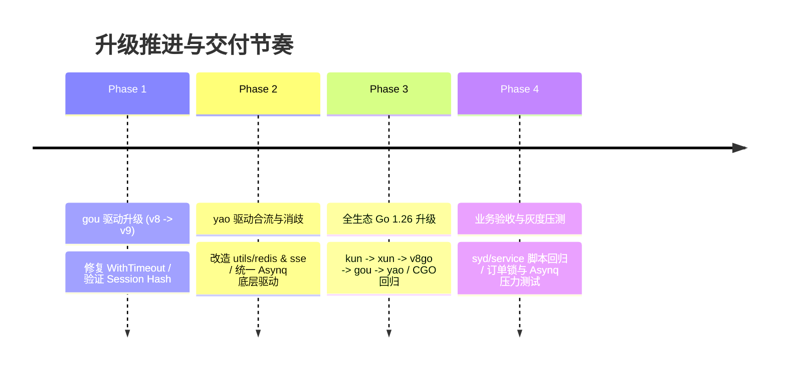

# SPEC-0002: Yao 全生态 Go 1.26 工具链与 Redis v9 现代化升级工程技术规范
(Yao Ecosystem Go 1.26 Toolchain & Redis v9 Modernization Engineering Specification)

| 元数据项 | 说明 |
| :--- | :--- |
| **RFC 编号** | RFC-20260923-GO126-REDISV9 |
| **状态** | Approved / Ready for Implementation |
| **目标仓库** | `yao`, `gou`, `kun`, `xun`, `v8go` |
| **影响范围** | 连接器抽象（Connector）、会话层（Session）、KV 存储（Store）、扩展工具箱（Utils/Redis）、事件总线（SSE）、CGO/V8Go 编译链、CI/CD 与工具链 |
| **基准版本** | 当前：Go 1.25.5, Redis v8.11.5；目标：Go 1.26.x, Redis v9.17+ |
| **业务兼容性** | 上层业务 DSL / TypeScript 脚本 100% 向后兼容（Zero-Breaking Guarantee） |

---

## 1. 概述与设计目标 (Executive Summary & Goals)

### 1.1 背景与问题陈述 (Problem Statement)
当前 Yao 生态底层运行时与关键中间件存在两个长期演进的技术痛点：
1. **Redis 驱动版本分裂（Dual-Driver Hybrid State）**：
   - 核心层（`gou/connector/redis`、`gou/session/redis`、`gou/store/redis`）及顶层工具（`yao/utils/redis`、`yao/sse/bus_redis`）仍深度绑定停止功能演进的旧版驱动 `github.com/go-redis/redis/v8 v8.11.5`；
   - 顶层引入的分布式异步任务引擎 `github.com/hibiken/asynq v0.26.0` 必须依赖现代驱动 `github.com/redis/go-redis/v9 v9.17.2`；
   - 导致单一二进制内**同时打包了两套独立的 Redis 客户端实现**，连接池相互隔离、符号冗余，且阻碍了 Asynq 与 Yao 统一连接器的互通。
2. **Go 工具链代际演进与 CGO 稳定性**：
   - 生态当前运行在 Go 1.25.5。升级至 Go 1.26 能够享受最新的编译器内联、PGO 优化、GC 吞吐提升与安全补丁；
   - 但 Yao 核心依赖 `rogchap.com/v8go`（C++17 / CGO / 预编译静态库），升级必须确保 CGO 内存安全与链接器兼容性，防范编译期报错与运行时 Crash。

### 1.2 核心目标 (Goals)
1. **消除 Redis 双驱动割裂**：彻底移除 `github.com/go-redis/redis/v8`，全量统一为官方活跃维护的 `github.com/redis/go-redis/v9`。
2. **规范化连接与超时模型**：根除废弃的 `.WithTimeout(...)` 链式调用，采用 `redis.Options`（`DialTimeout`/`ReadTimeout`/`WriteTimeout`）与严格的 `context.Context` 传播机制。
3. **上层业务零破坏（Zero-Breaking Guarantee）**：保证对上层应用（如 `syd/service`）暴露的 `Process("utils.redis.*", ...)`、Session 存储、Store 存储的入参与返回值语义 100% 保持一致，无需改动任何业务脚本。
4. **全生态 Go 1.26 稳定对齐**：按照底层优先顺序（`kun` $\to$ `xun` $\to$ `v8go` $\to$ `gou` $\to$ `yao`）统一提升 Go 版本与 `toolchain` 指令，并验证 V8Go 在 Go 1.26 下的 CGO 内存屏障与静态链接稳定性。

### 1.3 非目标 (Non-Goals)
- 不修改 Redis Connector 的 DSL 配置结构（保留 `host`, `port`, `user`, `pass`, `timeout`, `db` 等标准选项）。
- 不重构 Session 的核心存储逻辑（继续沿用已优化的高性能 Hash 聚合结构与 `opContext` 保护机制）。
- 不更换 Google V8 底层预编译二进制静态库（仅针对 Go 1.26 工具链下的 CGO 编译与桥接层进行兼容性加固）。

---

## 2. 架构演进与依赖拓扑 (Architecture Topology)

```
【升级前：双驱动分裂态】
  ┌─────────────────────────────────────────────────────────────┐
  │                         Yao Engine                          │
  ├──────────────────────────────┬──────────────────────────────┤
  │       gou/connector/redis    │      hibiken/asynq           │
  │       gou/session/redis      │                              │
  │       yao/utils/redis        │                              │
  │              │               │              │               │
  │              ▼               │              ▼               │
  │ github.com/go-redis/redis/v8 │ github.com/redis/go-redis/v9 │
  │    (两套连接池 / 符号冗余)    │       (// indirect 孤岛)     │
  └──────────────────────────────┴──────────────────────────────┘

【升级后：统一单驱动极简态】
  ┌─────────────────────────────────────────────────────────────┐
  │                   Yao Engine (Go 1.26)                      │
  ├──────────────────────────────┬──────────────────────────────┤
  │  gou/connector/redis (v9)    │                              │
  │  gou/session/redis   (v9)    │    hibiken/asynq (v9)        │
  │  gou/store/redis     (v9)    │                              │
  │  yao/utils/redis     (v9)    │                              │
  │  yao/sse/bus_redis   (v9)    │                              │
  │              │               │              │               │
  │              └───────────────┼──────────────┘               │
  │                              ▼                              │
  │               github.com/redis/go-redis/v9                  │
  │               (统一连接模型 / 标准 Context / 零冗余)         │
  └─────────────────────────────────────────────────────────────┘
```

---

## 3. 详细技术变更规范 (Detailed Technical Specifications)

---

### 3.1 `gou`：核心连接器与持久化驱动改造

#### 3.1.1 `connector/redis/redis.go` 改造规格
1. **结构体定义保持公开导出兼容**：
   ```go
   package redis

   import (
       "context"
       "fmt"
       "time"

       "github.com/redis/go-redis/v9" // 由 v8 替换为 v9
       "github.com/yaoapp/gou/application"
       "github.com/yaoapp/gou/connector/base"
       "github.com/yaoapp/gou/helper"
       "github.com/yaoapp/gou/types"
       "github.com/yaoapp/kun/any"
   )

   type Connector struct {
       base.NonSQL
       id      string
       file    string
       Name    string        `json:"name"`
       Rdb     *redis.Client `json:"-"` // 类型迁移为 *redis_v9.Client
       Options Options       `json:"options"`
       types.MetaInfo
   }
   ```
2. **连接初始化与超时重构**：
   - 彻底移除废弃的 `.WithTimeout(...)`；
   - 显式通过 `redis.Options` 设置 Dial/Read/Write 超时：
   ```go
   func (r *Connector) makeConnection() error {
       if r.Options.Host == "" {
           return fmt.Errorf("options.host is required")
       }

       timeout := time.Duration(r.Options.Timeout) * time.Second
       options := &redis.Options{
           Addr:         fmt.Sprintf("%s:%s", r.Options.Host, r.Options.Port),
           DB:           any.Of(r.Options.DB).CInt(),
           DialTimeout:  timeout,
           ReadTimeout:  timeout,
           WriteTimeout: timeout,
       }

       if r.Options.User != "" {
           options.Username = r.Options.User
       }
       if r.Options.Pass != "" {
           options.Password = r.Options.Pass
       }

       client := redis.NewClient(options)
       
       // 探测连接存活性（赋予 3 秒初始探测超时）
       pingCtx, cancel := context.WithTimeout(context.Background(), 3*time.Second)
       defer cancel()
       
       _, err := client.Ping(pingCtx).Result()
       if err != nil {
           return err
       }

       r.Rdb = client
       return nil
   }
   ```

#### 3.1.2 `session/redis.go` 改造规格
1. **构造函数变更**：
   ```go
   inst.options.Addr = fmt.Sprintf("%s:%d", host, port)
   inst.options.DialTimeout = inst.timeout
   inst.options.ReadTimeout = inst.timeout
   inst.options.WriteTimeout = inst.timeout

   client := redis.NewClient(inst.options)
   ```
2. **错误处理规范化**：
   - 废除字符串匹配 `strings.Contains(err.Error(), "redis: nil")`；
   - 统一采用 Go 标准 `errors.Is(err, redis.Nil)` 判定键不存在：
   ```go
   if err != nil && !errors.Is(err, redis.Nil) {
       log.Error("Session redis HGet: %s field: %s ERROR:%s", hkey, key, err.Error())
       return nil, err
   }
   ```

#### 3.1.3 `store/redis/types.go` & `store/redis/redis.go` 改造规格
- `types.go` 中 `Store` 结构体：
  ```go
  type Store struct {
      rdb    *redis.Client // v9
      Option Option
  }
  ```
- 验证所有操作（`Get`, `Set`, `Del`, `Has`, `Len`）在 v9 下行为完全对齐。

---

### 3.2 `yao`：进程层（Utils）与事件总线改造

#### 3.2.1 `yao/utils/redis/` 系列改造规格（8 个核心文件）
涉及文件清单：
- [`yao/utils/redis/redis.go`](file:///Users/L/Desktop/Code/yao_dev/yao/utils/redis/redis.go)
- [`yao/utils/redis/pipeline.go`](file:///Users/L/Desktop/Code/yao_dev/yao/utils/redis/pipeline.go)
- [`yao/utils/redis/advanced.go`](file:///Users/L/Desktop/Code/yao_dev/yao/utils/redis/advanced.go)
- [`yao/utils/redis/hash.go`](file:///Users/L/Desktop/Code/yao_dev/yao/utils/redis/hash.go)
- [`yao/utils/redis/list.go`](file:///Users/L/Desktop/Code/yao_dev/yao/utils/redis/list.go)
- [`yao/utils/redis/set.go`](file:///Users/L/Desktop/Code/yao_dev/yao/utils/redis/set.go)
- [`yao/utils/redis/zset.go`](file:///Users/L/Desktop/Code/yao_dev/yao/utils/redis/zset.go)
- [`yao/utils/redis/list_test.go`](file:///Users/L/Desktop/Code/yao_dev/yao/utils/redis/list_test.go)

1. **导入与命名空间统一**：
   ```go
   import (
       "errors"
       goredis "github.com/redis/go-redis/v9"
   )
   ```
2. **命令接口断言匹配**：
   在 `pipeline.go` 与 `redis.go` 中的命令类型断言：
   ```go
   // Pipeline 命令执行
   cmdResults := make([]goredis.Cmder, 0)
   ...
   _, err = pipe.Exec(ctx)
   if err != nil && !errors.Is(err, goredis.Nil) {
       exception.New("redis PIPELINE error: %s", 500, err.Error()).Throw()
   }

   // 批量清理中的结果断言
   for _, cmd := range cmds {
       if intCmd, ok := cmd.(*goredis.IntCmd); ok {
           count, _ := intCmd.Result()
           totalDeleted += count
       }
   }
   ```
3. **DSL Process 输出形态严格保真**：
   - `ProcessGet`：当键不存在（`errors.Is(err, goredis.Nil)`）时，严格返回 `nil`；
   - `ProcessExists`：返回存在的 int 计数；
   - `ProcessTTL`：返回 int64 秒数（-1 表示无过期，-2 表示不存在）；
   - `ProcessIncr` / `ProcessIncrBy`：返回自增后数值；
   - `ProcessClearPattern`：返回删除的 key 总计数。

#### 3.2.2 `yao/sse/bus_redis.go` 改造规格
- 更新 `client()` 私有方法中的转型逻辑：
  ```go
  redis, ok := selected.(*redisConnector.Connector)
  if !ok {
      return nil, fmt.Errorf("redis connector %q has unexpected type %T", connectorName, selected)
  }
  return redis.Rdb, nil // 返回 *redis_v9.Client
  ```
- 保持 `pubsub.ReceiveMessage(ctx)` 消费链路与退出机制稳定。

---

### 3.3 全生态 Go 1.26 工具链与 CGO 编译验证规范

#### 3.3.1 `go.mod` 级联提升顺序
升级必须严格遵守拓扑依赖层次，杜绝循环依赖与断链：
```
Level 0: kun    (github.com/yaoapp/kun)
Level 1: xun    (github.com/yaoapp/xun)
Level 2: v8go   (rogchap.com/v8go)
Level 3: gou    (github.com/yaoapp/gou)
Level 4: yao    (github.com/yaoapp/yao)
```
- 各模块配置目标：
  ```
  go 1.26.0
  toolchain go1.26.0
  ```

#### 3.3.2 `v8go` CGO 边界与系统不变量验证
针对 `rogchap.com/v8go`，在 Go 1.26 环境下进行关键路径专项压力验收：
1. **Zero-Copy ArrayBuffer 编解码**：
   - 验证 `codec.go` 中的 `v8go.NewUint8ArrayFromBytes` 在 Go 1.26 GC 逃逸分析与栈扫描下的稳定性；
2. **Context Scope 回收机制**：
   - 验证 `context.go` 中的 `ResetRetainedValues()` 重置上下文时，NativeContext 计数器始终恒定为 1，无内存泄漏与孤儿 Handle；
3. **CGO 指针安全级别测试**：
   - 执行高强度检查：
     ```bash
     CGO_ENABLED=1 GODEBUG=cgocheck=2 go test -v -run . ./...
     ```

---

## 4. 逐个仓库改造工程清单 (Implementation Blueprint)

### 4.1 仓库 1：`gou` (`/Users/L/Desktop/Code/yao_dev/gou`)
- **[MODIFY]** `go.mod`: 提升至 `go 1.26.0`, 移除 `redis/v8`, 添加 `github.com/redis/go-redis/v9 v9.17+`
- **[MODIFY]** `connector/redis/redis.go`: 替换为 v9 import，移除 `WithTimeout`，配置 options 显式超时
- **[MODIFY]** `session/redis.go`: 替换为 v9 import，移除 `WithTimeout`，优化 `errors.Is(err, redis.Nil)`
- **[MODIFY]** `store/redis/types.go`: 替换为 v9 `*redis.Client`
- **[MODIFY]** `store/redis/redis.go`: 替换为 v9 import，适配转型

### 4.2 仓库 2：`yao` (`/Users/L/Desktop/Code/yao_dev/yao`)
- **[MODIFY]** `go.mod`: 提升至 `go 1.26.0`, 移除 `redis/v8`, 将 `github.com/redis/go-redis/v9` 提升为直接依赖
- **[MODIFY]** `utils/redis/redis.go`: 替换为 v9 import，修正 Client 封装
- **[MODIFY]** `utils/redis/pipeline.go`: 替换为 v9 import，校验 `Pipeliner` 与 `Cmder` 断言
- **[MODIFY]** `utils/redis/advanced.go`: 替换为 v9 import
- **[MODIFY]** `utils/redis/hash.go`: 替换为 v9 import
- **[MODIFY]** `utils/redis/list.go`: 替换为 v9 import
- **[MODIFY]** `utils/redis/set.go`: 替换为 v9 import
- **[MODIFY]** `utils/redis/zset.go`: 替换为 v9 import
- **[MODIFY]** `utils/redis/list_test.go`: 替换为 v9 import
- **[MODIFY]** `sse/bus_redis.go`: 替换为 v9 import 与 Connector 获取逻辑

### 4.3 仓库 3、4、5：`kun`, `xun`, `v8go`
- **[MODIFY]** `kun/go.mod`: 提升至 `go 1.26.0`, `toolchain go1.26.0`
- **[MODIFY]** `xun/go.mod`: 提升至 `go 1.26.0`, `toolchain go1.26.0`
- **[MODIFY]** `v8go/go.mod`: 提升至 `go 1.26.0`

---

## 5. 系统不变量与零破坏保证 (Invariants & Guarantees)

1. **上层业务 DSL 零破坏**：
   - `syd/service` 中的业务代码（如 `lock.ts`、`auth_refresh.ts`、`user.ts` 等）包含数百处 `Process("utils.redis.*", ...)` 与 Session 调用。底层的驱动改造在 Go API 适配层被完全封装，业务 TypeScript 代码改动量为 **0**。
2. **Context 超时感知不变量**：
   - 所有的 Redis 网络操作必须遵守 Context 超时契约，严禁发起无超时的阻塞操作，避免网络抖动时耗尽 Goroutine。
3. **CGO 单 Context 拓扑不变量**：
   - Go 1.26 工具链下，V8 Runner 池中的 Context 回收逻辑必须严守 `ResetRetainedValues` 语义，绝对禁止退化为单请求频繁 `Close()` 与重新分配。

---

## 6. 验证矩阵与自动化测试规格 (Verification Matrix)

### 6.1 阶段性测试命令序列

| 阶段 | 验证目标 | 验证命令 | 预期结果 |
| :--- | :--- | :--- | :--- |
| **Phase 1** | `gou` Redis 模块与基础进程测试 | `go test -v -run TestProcess ./process/...`<br>`go test -v ./connector/redis/... ./store/redis/...` | 全量通过 (PASS)，无类型错配 |
| **Phase 2** | `yao/utils/redis` 功能验证 | `go test -v ./utils/redis/...` | 基础 Key、Hash、List、ZSet、Pipeline 100% 通过 |
| **Phase 3** | `v8go` CGO 内存安全与泄漏验证 | `CGO_ENABLED=1 go test -v -run TestZeroCopy .`<br>`CGO_ENABLED=1 go test -v -run TestContextRecycle .`<br>`CGO_ENABLED=1 go test -v -run Leak .` | 无 Segmentation Fault，内存无泄漏 |
| **Phase 4** | Yao 顶层编译与依赖消歧 | `export PATH=...; go build -o dist/yao .`<br>`go mod graph \| grep redis` | 编译成功，输出单一 `redis/v9` 节点 |
| **Phase 5** | 上层业务类型检查 | `cd /Users/L/Desktop/Code/yao_projects/syd/service && npx tsc --noEmit` | 0 Error，类型定义完全契合 |

### 6.2 边缘用例与压力验证
1. **Key 不存在返回语义**：
   - 验证 `ProcessGet("non_existent_key")` 返回 `nil` 而非抛出 500 异常；
2. **Pipeline 混合指令容错**：
   - 包含未命中 key 的 pipeline 不应导致整个 pipeline crash；
3. **Scan 游标跨批次遍历**：
   - 验证 `ClearPattern` 在超 10,000 个 Key 时的批次删除与游标归零退出条件。

---

## 7. 分阶段推进与回滚预案 (Phased Rollout & Rollback)



### 7.1 回滚兜底策略 (Rollback Strategy)
- **解耦式回滚**：由于实施计划将“**Redis v9 驱动合流**”与“**Go 1.26 工具链提升**”严格拆分在不同阶段：
  - 若在 Phase 3 中发现 Go 1.26 对 V8 预编译库存在不可调和的底层链接器破坏，可**立即回滚 `go.mod` 中的 Go 版本至 1.25.5**；
  - **Redis v9 的升级成果可独立保留**，不受编译器回滚影响，保障高价值架构治理成果不归零。

### 7.2 交付验收准则 (Definition of Done)
1. [ ] `yao` 二进制构建产物中不再包含任何 `github.com/go-redis/redis/v8` 符号。
2. [ ] `gou` 和 `yao` 中的所有单元测试均在 Go 1.26 下 100% 执行通过。
3. [ ] `v8go` 的 CGO 单元测试通过，未触发内存泄漏与非法指针崩溃。
4. [ ] `syd/service` 本地启动成功，Redis Session、分布式锁及 Asynq 队列处理运转正常。
