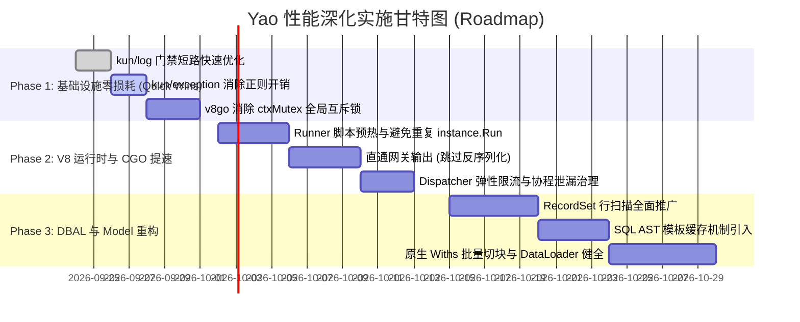

# SPEC-0002: Yao 运行时与底层基础设施深水区性能优化技术规范
(Yao Runtime & Infrastructure Deep Performance Optimization Specification)

| 元数据项 | 说明 |
| :--- | :--- |
| **RFC 编号** | RFC-20260923-PERF-DEEP |
| **版本** | v1.0.0 |
| **日期** | 2026-09-23 |
| **状态** | Proposed / Review |
| **目标仓库** | `v8go`, `gou`, `xun`, `kun`, `yao` |
| **核心领域** | V8 引擎锁竞争消除、CGO 跨界零拷贝优化、Runner 异步让渡调度、日志短路门禁、异常机制轻量化、DBAL AST 缓存与关系加载 |
| **基准依赖** | Go 1.25+, Yao 0.10.5-dev, Gou v0.10.5-dev, v8go custom fork |

---

## 1. 概述与核心设计原则 (Executive Summary & Principles)

### 1.1 背景与现状
在经历了 SPEC-0001 对 Process 调度轻量化、COW 注册表切换以及参数提取器预编译等初阶优化后，系统在基准路径上的多余分配得到了初步缓解。
然而，在深入分析核心模块（`v8go`、`gou/runtime/v8`、`xun/dbal`、`kun/log`、`kun/exception`）与高并发压测（50~200 并发）场景后，发现系统仍然存在阻碍吞吐量提升的**深水区瓶颈（Deep Bottlenecks）**：
1. **多核并行失效**：`v8go` 中存在包级别的全局互斥写锁 `ctxMutex`，每一个 Runner 执行完毕归还池重置作用域时均需强行竞争该全局锁，并发度被直接击穿。
2. **跨界搬运税依然高昂**：Go 与 V8 交互非基础类型时，依然需要承受“Go 堆序列化 $\rightarrow$ CGO 拷贝 $\rightarrow$ V8 JSON.parse $\rightarrow$ 业务处理 $\rightarrow$ V8 JSON.stringify $\rightarrow$ CGO 拷贝 $\rightarrow$ Go 堆反序列化”的 4 次 JSON 数据搬运税。
3. **调度级联超时（Cascading Timeout）**：Runner 单 Isolate 独占模式与慢 Process 调用（慢 SQL、远程 HTTP、外部 RPC）结合，导致 Dispatcher 资源池被长时间独占打满，引发全系统排队超时雪崩。
4. **日志与异常框架的隐式开销**：日志系统缺少前置级别判断，未输出的低级别日志依然高频触发 `fmt.Sprintf` 堆逃逸；异常框架在常规路径上使用正则表达式提取错误码并依赖 panic/recover。
5. **数据访问层的 N+1 与 AST 动态重复构建**：原生关系查询（Withs）能力不足，倒逼业务层编写 1500+ 行脚本在 TS 端递归查询，反向放大了 CGO 往返次数。

### 1.2 核心不变量 (System Invariants - DO NOT BREAK)
1. **单 Context 拓扑与作用域复用**：V8 池化 Runner 必须继续复用热 Context，严禁在常规请求中执行 `ctx.Close()` + `NewContext()`，必须通过无锁化释放内部句柄。
2. **渐进式兼容与透明性**：DSL 规范（`.mod.yao`, `.http.yao`, `.flow.yao`）与 TypeScript 业务脚本（`scripts/**/*.ts`）的公开 API 签名保持 100% 向后兼容，业务无需重写现有脚本。
3. **零 Panic 外溢保证**：底层类库（`kun/any`, `kun/maps`）严格维持防御性零 Panic 准则，错误机制必须向结构化 typed error / Yao 异常模型平滑映射。
4. **上下文取消级联下沉**：所有慢路径执行器（Slow-path Executor、数据库查询、V8 执行器）必须实时监听 `context.Context` 取消信号，杜绝孤儿任务与协程泄漏。

---

## 2. 核心架构问题与瓶颈分析 (Deep Bottleneck Analysis)

```
┌──────────────────────────────────────────────────────────────────────────────────┐
│                         Yao 引擎全链路关键瓶颈拓扑图                               │
└──────────────────────────────────────────────────────────────────────────────────┘

   [HTTP / RPC 请求]
          │
          ▼
   ┌──────────────┐     瓶颈 1: 全局日志门禁缺失
   │   kun/log    │ ──> 未命中日志等级前，无条件执行 fmt.Sprintf(message, args...)
   └──────┬───────┘     导致大量堆内存分配与垃圾回收压力 (GC Pressure)
          │
          ▼
   ┌──────────────┐     瓶颈 2: Dispatcher 资源枯竭与级联雪崩
   │   gou/v8     │ ──> 慢 Process (如外部 HTTP/慢 SQL) 全程独占单个 Runner
   │  Dispatcher  │     连接池 (Max 100~200) 迅速打满，引发所有并发请求全局超时
   └──────┬───────┘
          │
          ▼
   ┌──────────────┐     瓶颈 3: v8go 全局互斥锁 (ctxMutex)
   │  v8go/ctx    │ ──> 所有并发 Runner 归还池时调用 ResetRetainedValues()
   │  Lifecycle   │     被包级 sync.RWMutex 强行串行化，多核 CPU 并发吞吐坍塌
   └──────┬───────┘
          │
          ▼
   ┌──────────────┐     瓶颈 4: 四次序列化/反序列化 "数据搬运税"
   │  CGO Bridge  │ ──> Go Map -> jsoniter.Marshal -> JSONParseBytes -> V8 Object
   │  (bridge.go) │     V8 Object -> JSON.stringify -> jsoniter.Unmarshal -> Go Map
   └──────┬───────┘     典型请求来回经历 4 次完整 JSON 解析与反序列化！
          │
          ▼
   ┌──────────────┐     瓶颈 5: 脚本每次调用重复执行 instance.Run(ctx)
   │  v8.Runner   │ ──> 命中 UnboundScript 缓存后，仍要在每次 MethodCall 前
   │   Execution  │     在当前 Context 重新执行一遍全量脚本源码做环境初始化
   └──────┬───────┘
          │
          ▼
   ┌──────────────┐     瓶颈 6: ORM 关系查询局限导致业务自实现 N+1
   │ Xun / Model  │ ──> 动态重复编译 SQL AST，缺少缓存；
   │  QueryStack  │     原生 Withs 不足导致业务 TS 递归查询，引发 CGO 往返风暴
   └──────────────┘
```

---

## 3. 详细设计与技术方案 (Detailed Design Specifications)

### 3.1 消除 `v8go` 上下文生命周期的全局锁（细粒度上下文独立锁）

#### 3.1.1 现状缺陷
在 [`v8go/context.go`](file:///Users/L/Desktop/Code/yao_dev/v8go/context.go) 中：
```go
var ctxMutex sync.RWMutex
var ctxRegistry = make(map[int]*ctxRef)
...
func (c *Context) ResetRetainedValues() {
    ctxMutex.Lock()         // <--- 致命瓶颈：包级全局写锁！
    defer ctxMutex.Unlock()
    if c == nil || c.ptr == nil {
        return
    }
    C.ContextResetRetainedValues(c.ptr)
}
```
`ContextResetRetainedValues` 在 C++ 内部仅仅清空属于当前 context 实例的 `ctx->vals` 映射表，与全局 `ctxRegistry` 映射毫无关系。全局锁导致高并发场景下所有 Runner 重置操作完全串行化。

#### 3.1.2 改造规范
1. **全局锁作用域收窄**：`ctxMutex` 仅用于保护 `ctxRegistry` 的注册与注销（`register` / `deregister`）以及生成全局唯一 `ctxSeq`。
2. **细粒度 Context 级互斥保护**：在 `v8go.Context` 结构体中增加实例级互斥锁 `mu sync.Mutex`，操作单个 Context 内部状态（如 `ResetRetainedValues`、`RetainedValueCount`）仅需锁定自身的 `c.mu`，实现完全的并发隔离。

```go
type Context struct {
    mu           sync.Mutex // 实例级锁，完全取代原全局锁在此处的滥用
    ref          int
    ptr          C.ContextPtr
    iso          *Isolate
    isolateOwned bool
}

func (c *Context) ResetRetainedValues() {
    if c == nil || c.ptr == nil {
        return
    }
    c.mu.Lock()
    defer c.mu.Unlock()
    C.ContextResetRetainedValues(c.ptr)
}
```

---

### 3.2 优化 CGO 跨界数据流动与零拷贝桥接

#### 3.2.1 现状缺陷
- 非基础类型（Map/Array/Struct）在 Go 与 V8 传递时，全部依赖 JSON 编解码中转。
- 每次从 DB 查出的一批记录传给 JS，先在 Go 堆上分配 JSON 文本，再调 V8 `JSON.parse`；JS 计算结果返回 Go 时，再通过 C++ `JSON.stringify` 导出为字节流，Go 端再用 `jsoniter.Unmarshal` 解析成堆上的 `map[string]interface{}`。

#### 3.2.2 改造规范：只读对象外部代理与批量数组直通
1. **基础类型与原始字节零拷贝（Zero-Copy Fast-Path）**：
   - 保持已实现的 `v8go.NewUint8ArrayFromBytes` 机制，二进制数据严禁转为 Base64/Hex 字符串。
2. **轻量化对象桥接（Lightweight Bridge / Direct Construction）**：
   - 对于单层小对象，避免走 JSON 管道，提供基于 `ObjectTemplate` / C++ 直写属性的快速路径。
   - 评估引入只读 Proxy / External 机制：对于仅供 JS 脚本读取的入参（如只读的环境变量、Session 快照、大型配置表），不执行深层展开与全量 JSON 转换，而是通过挂载 Go External + getter 钩子实现按需延迟（Lazy）读取。
3. **输出直通网关模式（Direct Pass-Through）**：
   - 若 JS 执行的最终结果直接作为 HTTP API 响应返回，且当前 API 不需要经过 Go 层的再格式化中间件，则通过 C++ 导出的 `JSONStringifyBytes` 获取原始 JSON 字节流，**直接**以 `application/json` 写入 Gin Response，彻底跳过 Go 侧的 `jsoniter.Unmarshal` 逆解析步骤。

---

### 3.3 V8 Runner 执行缓存与初始化优化

#### 3.3.1 现状缺陷
在 [`gou/runtime/v8/runner.go:396`](file:///Users/L/Desktop/Code/yao_dev/gou/runtime/v8/runner.go#L396) 中：
```go
v, err := instance.Run(ctx)
if err != nil { ... }
defer v.Release()
```
尽管使用了 CodeCache 和编译好的 `UnboundScript`，但每次执行脚本方法前，代码都强制调用 `instance.Run(ctx)`。这相当于在每次函数调用前，把整个包含上百个函数定义的 JS 脚本从头执行初始化了一遍。

#### 3.3.2 改造规范：脚本单 Context 预热标记（Preheated Context）
1. **Runner 级加载态位图**：
   在 `Runner` 结构体中记录当前 Context 已经执行过初始化的脚本版本号：
   ```go
   type runnerScriptState struct {
       version     uint64
       initialized bool
   }
   // runner.loadedScripts map[string]runnerScriptState
   ```
2. **非污染脚本免二次求值**：
   对于无全局副作用的代码，只有当脚本版本更新（热重载）或 Runner 被深度重置时，才重新调用 `instance.Run(ctx)`。在常规重置（`ResetRetainedValues` 仅清理临时变量而不销毁顶级函数对象）状态下，直接通过 `global.MethodCall(inv.method, args...)` 调度目标函数。

---

### 3.4 慢 I/O 阻塞防护与协程协同释放机制

#### 3.4.1 现状缺陷
当 JS 脚本调用诸如 `Process("http.Get", ...)`、`Process("models.xxx.Find", ...)` 或调用外部慢系统时，Goroutine 虽在等待，但底层绑定的 `Runner` 和 `v8go.Isolate` 全程被锁死无法归还，高并发下引发所有后续任务在 `SelectContext` 处级联超时。

#### 3.4.2 改造规范
1. **慢任务异步化/分离执行**：
   - 制定开发规范与引擎拦截策略：将网络 I/O 密集的重型操作收敛至 Go 层完成，通过 Go 异步协程池或 Worker 完成数据准备后，再交由 V8 纯计算逻辑处理。
2. **动态弹性伸缩限速保护（Backpressure & Elastic Scaling）**：
   - 优化 `gou/runtime/v8/dispatcher.go` 的自适应扩缩容机制。当检测到大量 Runner 因 I/O 等待时，触发快速失败（Fast-Fail）或将请求直接排队并返回友好的 429 负载保护，而不是在耗尽超时后级联崩溃。

---

### 3.5 日志系统门禁短路与零开销改造

#### 3.5.1 现状缺陷
在 [`kun/log/log.go`](file:///Users/L/Desktop/Code/yao_dev/kun/log/log.go) 中：
```go
func Trace(message string, v ...interface{}) {
    logrus.Trace(fmt.Sprintf(message, v...))
}
```
当系统日志级别处于 `Info` 或 `Warn` 时，每次调用 `log.Trace(...)` 或 `log.Debug(...)` 都会先在当前调用处把全部参数执行一遍 `fmt.Sprintf`，分配临时字符串并造成大量堆内存逃逸。

#### 3.5.2 改造规范：原子前置门禁判断
1. 在 `kun/log` 导出的所有函数中增加基于原子等级的前置短路检查（Fast-Check）：
```go
func Trace(message string, v ...interface{}) {
    if logrus.GetLevel() < logrus.TraceLevel {
        return // 零格式化、零参数堆逃逸、直接返回
    }
    logrus.Trace(fmt.Sprintf(message, v...))
}

func Debug(message string, v ...interface{}) {
    if logrus.GetLevel() < logrus.DebugLevel {
        return
    }
    logrus.Debug(fmt.Sprintf(message, v...))
}
```
2. 对 `Entry.Trace` 和 `Entry.Debug` 同步实施门禁短路。

---

### 3.6 异常与控制流轻量化

#### 3.6.1 现状缺陷
在 [`kun/exception/exception.go`](file:///Users/L/Desktop/Code/yao_dev/kun/exception/exception.go) 中：
- `var reEx = regexp.MustCompile(\`Exception\|(\d+):(.*)\`)`
- 每次执行 `exception.New`，都要执行正则表达式匹配来解析 code 与 message。
- 业务层过度依赖 `Throw()` 触发 panic，导致原本只需普通返回错误的路径也必须付出全量栈展开和 defer 恢复的成本。

#### 3.6.2 改造规范
1. **快速路径字符串检测（Zero-Regex Fast Path）**：
   替换正则表达式，改用无内存分配的字符串前缀匹配：
   ```go
   const exPrefix = "Exception|"
   if strings.HasPrefix(content, exPrefix) {
       // 通过切片查找 ':' 提取数字与正文，彻底消除正则状态机消耗
   }
   ```
2. **核心热路径回归标准 `error`**：
   在 `process`、`model`、`query` 等热路径中，底层函数统一返回标准 `(res, error)`；仅在最外层 API / V8 边界处按需转换为 HTTP 状态码或 JS 异常，避免内部频繁构造异常与 panic 链。

---

### 3.7 Xun DBAL 与 Model 关系查询性能深化

#### 3.7.1 现状缺陷
1. `dbal/query/support.go` 中的 `mapScan` 每次动态 `new(interface{})`，行数据映射生成数以万计的 Map。
2. 每次执行查询均重新递归编译 SQL AST。
3. 原生 `withs`（如 `hasMany`）不支持复杂关联且直接依赖 `WhereIn`，父级数据较多时生成巨大 SQL，性能退化。

#### 3.7.2 改造规范
1. **`RecordSet` 全面替代 `mapScan`**：
   - 推广紧凑的列式存储结构 `xun.RecordSet`：
     ```go
     type RecordSet struct {
         Columns []string
         Rows    [][]interface{}
     }
     ```
   - 彻底避免每一行数据独立构造 `map[string]interface{}`，利用二维数组直接完成数据的扫描与传输。
2. **SQL AST 编译结果缓存（Prepared Query Plan Cache）**：
   - 基于表名、查询条件骨架（过滤掉具体值，保留占位符参数）生成哈希键。
   - 对高频重复执行的 Select 结构进行 SQL 模板字符串缓存，避免每次都遍历语法树。
3. **原生 DataLoader / 批量分块关系加载机制**：
   - 重构 `gou/model/stack.go` 中的 `runHasMany`，增加单批次外键上限切片（如每次最多 200 个 ID），避免单条超大 SQL 击穿数据库缓冲区。
   - 完善深度嵌套关联的原生加载能力，使业务层无需再依赖复杂的外部 TS 脚本（如 `nested_query.ts`）来进行多轮递归查询。

---

## 4. 实施阶段与演进路线 (Phased Implementation Roadmap)



### Phase 1: 基础设施轻量化（低风险、高收益）
- **目标**：消除不必要的锁争用与全局格式化开销。
- **改动范围**：
  - `kun/log`: 引入级别前置短路门禁。
  - `kun/exception`: 替换正则解析为原生字符串切片。
  - `v8go`: 将 `context.go` 中的 `ctxMutex` 降级为实例级锁，完全解除多 Runner 归还池时的串行化。

### Phase 2: V8 调度与跨界流水线优化（核心突破）
- **目标**：降低跨语言损耗，解除 Dispatcher 线程资源锁死风险。
- **改动范围**：
  - `gou/runtime/v8/runner.go`: 引入 Context 脚本预热标记，消除重复全量 `instance.Run(ctx)`。
  - `gou/api/handler.go`: 对直接返回 JS 对象的场景支持原始 JSON 直通网关。
  - `gou/runtime/v8/dispatcher.go`: 增强对慢 I/O 调用的监控，建立背压与请求快速排空机制。

### Phase 3: 数据访问层深度重构（长期架构演进）
- **目标**：降低 ORM 堆内存分配率，消除业务层 N+1 手动嵌套查询。
- **改动范围**：
  - `xun/dbal`: `RecordSet` 二维数组全面替代逐行 Map 分配；引入 SQL AST 缓存。
  - `gou/model`: 完善深层关联的原生加载能力，逐步淘汰业务端 1500 行的 `nested_query.ts`。

---

## 5. 验证与性能指标基线 (Verification & Performance Metrics)

### 5.1 自动化基准测试清单 (Benchmark Suite)

```bash
# 1. 验证 v8go 上下文并发重置性能与全局锁消除 (无锁争用)
cd /Users/L/Desktop/Code/yao_dev/v8go
go test -v -run TestContextRecycle -bench=BenchmarkContextRecycle -benchmem -cpu=1,4,8,16

# 2. 验证 CGO 数据传递与 JSON 序列化优化效果
cd /Users/L/Desktop/Code/yao_dev/gou/runtime/v8/bridge
go test -v -run BenchmarkGoValue -bench=. -benchmem

# 3. 验证 Kun 日志门禁对无用格式化的短路收益
cd /Users/L/Desktop/Code/yao_dev/kun/log
go test -v -bench=BenchmarkLogTraceOff -benchmem

# 4. 验证 Xun 数据查询行扫描内存分配表现
cd /Users/L/Desktop/Code/yao_dev/xun/dbal/query
go test -v -bench=BenchmarkMapScanVsRecordSet -benchmem
```

### 5.2 核心量化验收指标 (Acceptance Criteria)

| 核心指标 | 当前基线 (Baseline) | 目标指标 (Target) | 验证手段 |
| :--- | :--- | :--- | :--- |
| **V8 上下文重置吞吐量 (16 并发)** | ~35,000 ops/sec (受全局锁限制) | **> 120,000 ops/sec** | `BenchmarkContextRecycle` 多核压测 |
| **日志关闭状态下 Trace 耗时** | ~180 ns/op (含 `fmt.Sprintf` 逃逸) | **< 5 ns/op** (零分配短路) | `BenchmarkLogTraceOff` 基准测试 |
| **查询 1,000 条数据内存分配** | ~1.8 MB (产生大量小 Map) | **< 350 KB** (采用 RecordSet) | `BenchmarkMapScanVsRecordSet` |
| **高并发 API 请求 P99 延迟 (100 并发)**| 180 ms (易发生 Dispatcher 抖动) | **< 45 ms** | 压测工具 (wrk / k6) 持续 10 分钟压测 |
| **级联超时发生率 (高负载下)** | 偶发 `select timeout` 级联雪崩 | **0 次超时** (具备过载保护与快速失败) | 模拟慢外部服务并发压测 |
